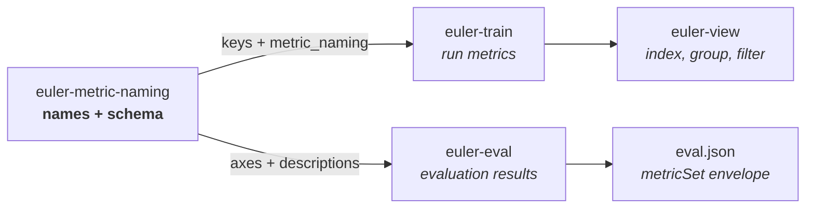

<!-- euler header — shared across the euler packages.
     Per package, change only: the <h1>, the tagline, and the badge URLs. -->
<p align="center">
  
</p>

<h1 align="center">euler-metric-naming</h1>

<p align="center">
  <em>Make flat ML metric keys self-describing.</em>
</p>

<p align="center">
  <a href="https://pypi.org/project/euler-metric-naming/"></a>
  <a href="https://pypi.org/project/euler-metric-naming/"></a>
  <a href="LICENSE"></a>
  <a href="https://github.com/d-rothen/euler-metric-naming/actions/workflows/ci.yml"></a>
</p>

---

Metric logs are usually flat dictionaries. A key such as `loss` is easy to
write, but it does not say what was measured, where it came from, or how a
downstream tool should group it. This package turns that key into a small,
validated schema:

```text
loss = 0.089  →  depth.train.loss.final.log_radius = 0.089
```

It builds metric names, declares the axes inside them, attaches display
metadata, and serializes the declaration beside the values. It does not collect,
store, or render metrics; it is the shared naming contract between those jobs.

## Anatomy of a metric name

| `depth` | `train` | `loss` | `final` | `log_radius` |
|---|---|---|---|---|
| scope | context | kind axis | stage axis *(optional)* | base metric |

Together, `depth.train` is the **namespace**. The remaining declared axes make
the hierarchy useful for indexing and filtering, while `log_radius` identifies
the measurement itself:

```text
{scope}.{context}.{axes...}.{metric}
```

Axes are described by position and allowed values. Consumers can therefore
decompose a name structurally instead of guessing from substrings.

## Where it fits



- [`euler-train`](https://github.com/d-rothen/euler-train) still logs a flat
  `dict[str, float]`; the accompanying `metric_naming` payload tells
  [`euler-view`](https://github.com/d-rothen/euler-view) how to interpret it.
- [`euler-eval`](https://github.com/d-rothen/euler-eval), the package's main
  consumer today, writes the same declarations as a `metricSet` envelope in
  each `eval.json`.
- `euler-metric-naming` owns the shared construction, validation,
  decomposition, and serialization rules so producers do not drift apart.

## Install

```bash
pip install euler-metric-naming
```

The core package has no runtime dependencies. Install
`euler-metric-naming[contract]` to additionally warn when a modality is not in
the [`euler-dataset-contract`](https://github.com/d-rothen/euler-dataset-contract)
registry.

## Quick start: training metrics

Declare the modalities and any pipeline stages once:

```python
from euler_metric_naming import MetricDescription, MetricNamespace

metrics = MetricNamespace(
    producer="euler_train.weather_model",
    producer_version="0.1.0",
    modalities=("depth", "rgb"),
    stages=("prior", "final"),
    descriptions={
        "depth_mae": MetricDescription(
            display_name="Depth MAE",
            is_higher_better=False,
            unit="meters",
        ),
    },
)
```

Then use the namespace wherever values are logged:

```python
values = {
    metrics.loss("depth", "prior", "log_radius"): 0.152,
    metrics.diag("depth", "final", "depth_mae"): 0.283,
    metrics.loss("depth", metric="total"): 1.234,
    metrics.sys("lr"): 3e-5,
}

# {
#   "depth.train.loss.prior.log_radius": 0.152,
#   "depth.train.diag.final.depth_mae": 0.283,
#   "depth.train.loss.total": 1.234,
#   "sys.train.lr": 3e-5,
# }
```

Pass the declaration beside those values when initializing `euler-train`:

```python
import euler_train

run = euler_train.init(
    config=config,
    metric_naming=metrics.training_naming_config(),
    stream=stream,
)
run.log(values, step=step, epoch=epoch)
```

Stages are optional. Omit `stages=` and build names with
`metrics.loss("depth", metric="mae")` when a model has no staged pipeline.
Invalid modalities, stages, or name segments raise `ValueError` at the point of
construction.

## Evaluation envelopes

Evaluation schemas often use axes such as space, category, and reduction rather
than training's kind and stage. Supply those declarations directly:

```python
from euler_metric_naming import AxisDeclaration, MetricDescription, MetricNamespace

evaluation = MetricNamespace(
    producer="euler_eval.depth",
    producer_version="2.0.0",
    modalities=("depth",),
    context="eval",
    axes={
        "space": AxisDeclaration(
            position=0,
            values=("native", "metric"),
        ),
        "reduction": AxisDeclaration(
            position=1,
            values=("image_mean", "pixel_pool"),
            optional=True,
        ),
    },
    descriptions={
        "absrel": MetricDescription(is_higher_better=False),
    },
)

metric_set = evaluation.metric_set_envelope("depth")
```

The resulting JSON-ready envelope declares `depth.eval`, its axes, producer
provenance, and the display semantics of `absrel`. `euler-eval` places this
object under `metricSet` next to the metric tree.

## Read and filter names

```python
from euler_metric_naming import decompose, filter_kind

parsed = decompose(
    "depth.train.loss.prior.log_radius",
    "depth.train",
    metrics.axes("depth"),
)

parsed.axes       # {"kind": "loss", "stage": "prior"}
parsed.metric     # "log_radius"
parsed.recompose()  # "depth.train.loss.prior.log_radius"

losses = filter_kind(values, metrics, "depth", "loss")
```

The public helpers also include `recompose`, `compare_stages`, `filter_glob`,
and `validate_metric_name`. See the [API guide](docs/api.md) for payload shapes,
description fields, matching behavior, and naming constraints.

## Development

```bash
git clone https://github.com/d-rothen/euler-metric-naming.git
cd euler-metric-naming
uv sync --extra dev                 # or: pip install -e ".[dev]"
uv run pytest
uv run ruff check .
```

See [CONTRIBUTING.md](CONTRIBUTING.md) for test and release guidance.

## License

[MIT](LICENSE) © Daniel Rothenpieler
